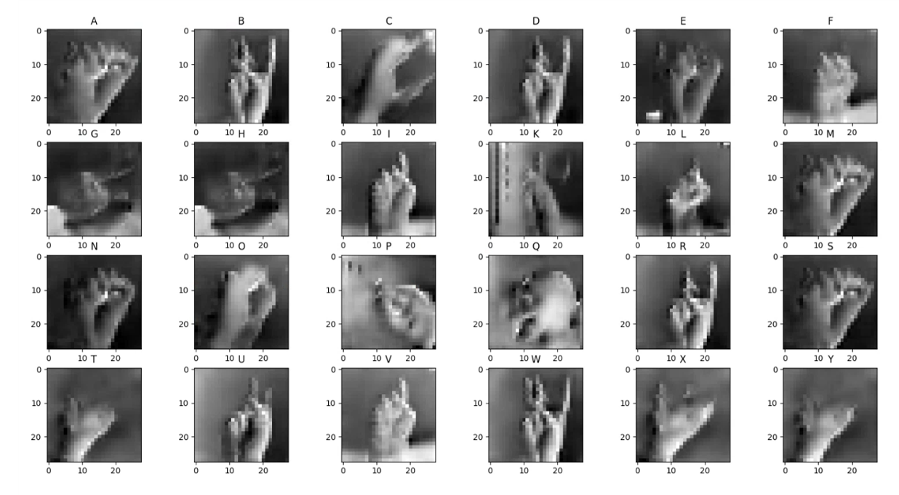
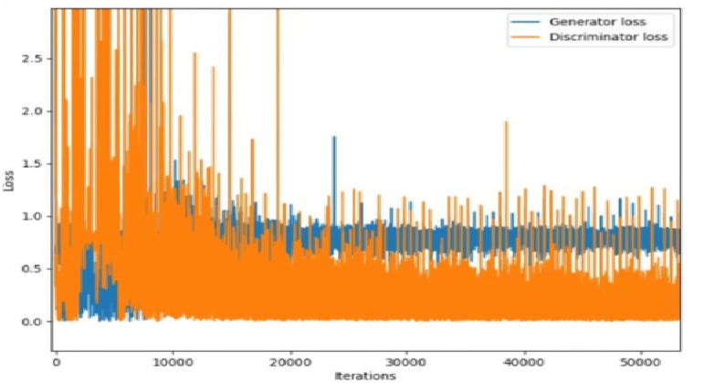
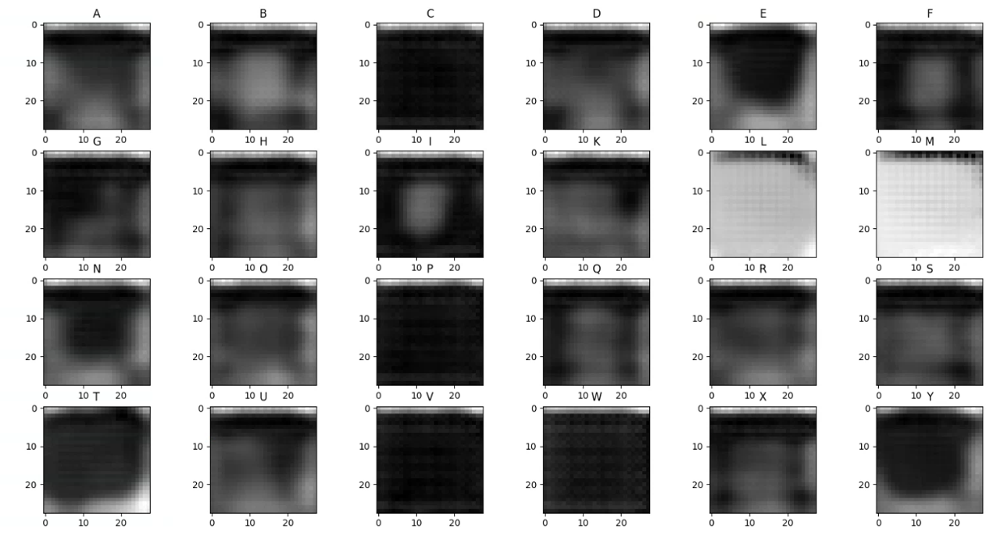
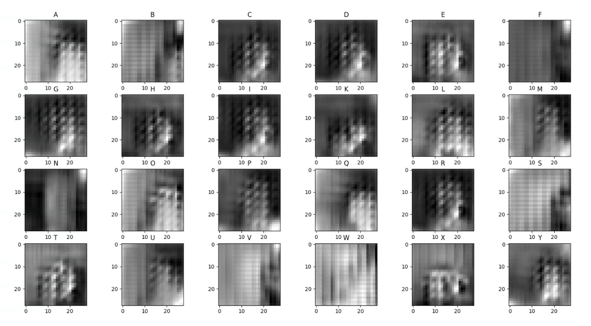
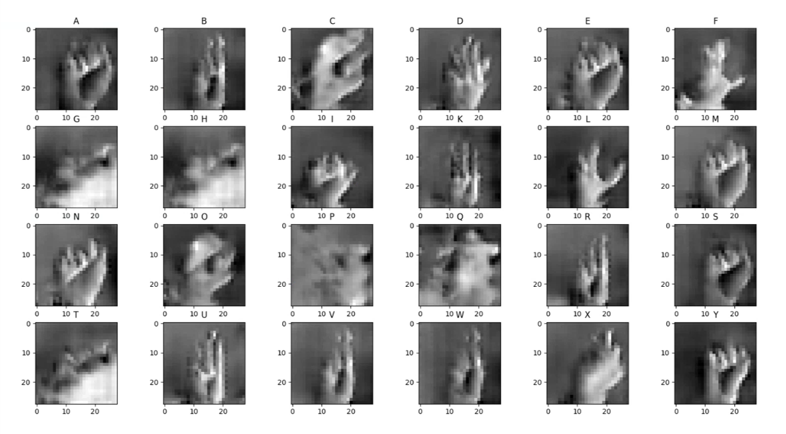

<h1 align="center">ASLetter – Generating ASL Images From English Letters</h1>

<h2 align="center">
Final project for the Technion's EE Deep Learning course (046211)
</h2>

  Nir Ben Haim
   
  David Levit

---

## Background

ASLetter is a conditional image generation project that maps English alphabet letters to their corresponding American Sign Language (ASL) hand-sign images.

The project explores adversarial generative modeling using a conditional GAN architecture trained on the Sign Language MNIST dataset. During development, we experimented with convolutional generator/discriminator architectures, normalization techniques, optimization strategies, wasserstein inspired loss, soft labels, and learning-rate scheduling in order to improve training stability and generated image quality.

The work focuses on practical GAN training challenges including unstable convergence, discriminator-generator balance, and conditional image synthesis.

---

## An Illustration of the Model

  

---

## Results

### Original ASL Images

  

### Generated ASL Images

  

---

## Training Dynamics

Generator and discriminator losses during training over 100 epochs.

  

The training process demonstrates several common GAN behaviors, including early instability, discriminator dominance during initial training stages, and gradual stabilization as training progresses.

---

## Additional Generated Samples

### Epoch 1

  

### Epoch 10

  

### Epoch 30

  

### Epoch 100

  

---

## Technical Highlights

- Conditional image generation from English letters to ASL gesture images.
- Generator and discriminator implemented using convolutional and linear layers.
- Label conditioning using one-hot encoded class representations.
- Training stabilization experiments including:
  - Batch normalization
  - Dropout
  - Soft labels
  - RMSprop optimization
  - Learning-rate scheduling
- Empirical investigation of GAN training dynamics and convergence behavior.

---

## Files in the Repository

| File Name | Purpose |
|---|---|
| `main.py` | Main application entry point |
| `model.py` | Generator and discriminator architectures |
| `train.py` | GAN training pipeline |
| `util.py` | Utility functions for visualization and loss computation |
| `data.py` | Dataset loading and preprocessing |
| `import_dataset.py` | Dataset download/import utilities |

---

## Running Example

| Arguments                                                     | Purpose                                                                                                                                       |
|---------------------------------------------------------------|-----------------------------------------------------------------------------------------------------------------------------------------------|
| `--eval`                                                      | Model evaluation if true. Model training and evaluating if false                                                                              |
| `--model_path`                                                | Model save/load directory                                                                                                                     |
| `--data_path`                                                 | Dataset save/load directorys                                                                                                                  |
| `--chosen_letter`                                             | Letter chosen to be printed, only when purely evaluating                                                                                      |

* In order to use the GAN without traning eval = True, model_path and data_path contains the wanted directory, and in order to get specific letter implement it in chosen_letter. 
* In order to train the GAN eval = False, model_path and data_path contains the wanted directory.

---

### Challenges and Lessons Learned

During development we encountered several common GAN training issues, including unstable losses, discriminator dominance, and limited diversity in generated samples. We experimented with different optimization methods, architectural configurations, normalization layers, and learning-rate scheduling strategies in order to improve convergence stability and image quality.

We also observed that data augmentation techniques for ASL datasets must be carefully designed, since aggressive geometric transformations may alter the semantic meaning of hand gestures.

---

### Dataset

This project uses the Sign Language MNIST dataset:

https://www.kaggle.com/datasets/datamunge/sign-language-mnist

The dataset contains grayscale images representing ASL hand gestures for English alphabet letters.

---

### Refrences
* [https://github.com/soumith/ganhacks](https://github.com/soumith/ganhacks).
* Wasserstein GAN - Martin Arjovsky et AL, 2017
* Conditional Generative Adversarial Nets - Mehdi Mirza et AL, 2014
